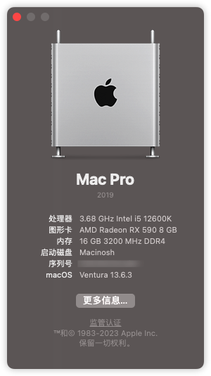
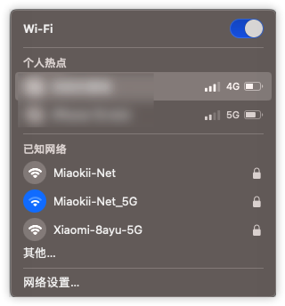

# MAG-B660M-DDR4-12600KF-RX590-EFI

微星B660m迫击炮D4版（不带wifi）12600KF RX590 EFI

## 配置

| CPU    | 12600FK                   |
|--------|---------------------------|
| 主板   | 微星MAG B660M MORTAR DDR4 |
| 显卡   | 蓝宝石RX590超白金         |
| 内存   | 威刚 DDR4 3200 8G*2       |
| OC版本 | 0.9.7                     |
| OS版本 | macOS 13.6.3              |

## 更新记录

当前问题：

- WIFI不稳定，可以扫到wifi，链接超时，隔空投送可用

### 2023/12/16
- 升级OC 0.9.7
- 升级macOS 13.6.3 

## 截图

## 链接
- [yzchan/MSI-MAG-B660M-MORTAR-DDR4-12600K-EFI](https://github.com/yzchan/MSI-MAG-B660M-MORTAR-DDR4-12600K-EFI)
- [hackintosh-club/MAG-B660M-MORTAR-WIFI-DDR4-OpenCore](https://github.com/hackintosh-club/MAG-B660M-MORTAR-WIFI-DDR4-OpenCore)
- [echokk11/Hackintosh_i7-12700kf_ASUS-B660M-PLUS-D4_5700xt](https://github.com/echokk11/Hackintosh_i7-12700kf_ASUS-B660M-PLUS-D4_5700xt)
- [13thdemarch/b660m-aorus-pro-hackintosh](https://github.com/13thdemarch/b660m-aorus-pro-hackintosh)
- [XuCpeng/MAG_B660M_MORTAR_WIFI_D4-12600KF-RX580-Hackintosh-OpenCore-EFI](https://github.com/XuCpeng/MAG_B660M_MORTAR_WIFI_D4-12600KF-RX580-Hackintosh-OpenCore-EFI)